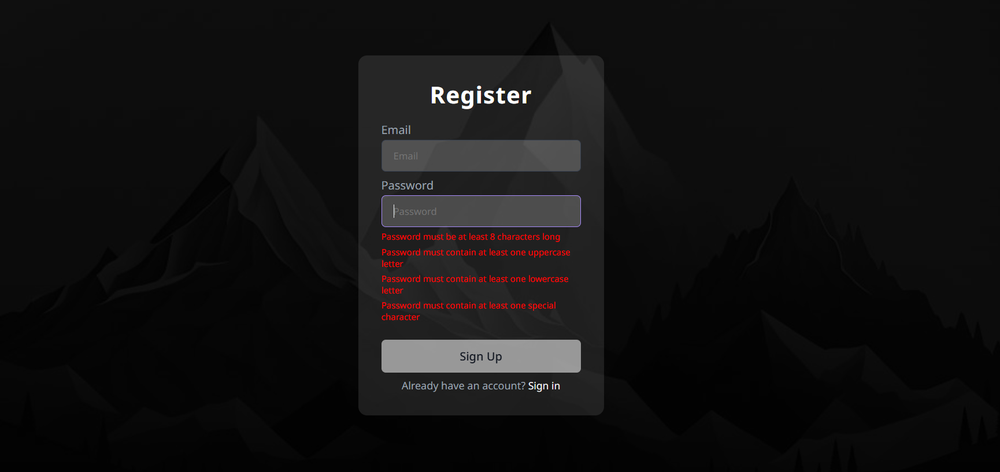

# Authenticator Angular

A modern Angular authentication application with login and registration functionality, built with reactive forms and real-time validation.

## Project Overview

This is a standalone Angular 19 application that demonstrates a complete authentication system with email validation, password requirements, and persistent user sessions. The application uses a JSON server for backend mock data and local storage for token management.



## Features

- **User Authentication**: Login and registration system
- **Real-time Form Validation**: Email format, password strength requirements
- **Token-based Sessions**: localStorage for persistence
- **Reactive Forms**: Angular FormBuilder with custom validators

## Prerequisites

- Node.js 18+ and npm 9+
- Modern web browser (Chrome, Firefox, Edge, Safari)

## Installation

```bash
npm install
```

## Quick Start

**Option 1: Angular Dev Server Only**
```bash
npm start
```
App runs at `http://localhost:4200`

**Option 2: Angular App + Mock API (JSON Server)**

Terminal 1:
```bash
npm run mock:server
```
Mock API runs at `http://localhost:3000`

Terminal 2:
```bash
npm start
```
App runs at `http://localhost:4200`

## Validation Rules

**Email**: Must match format `user@mail.com`

**Password**: 
- Minimum 8 characters
- 1 uppercase letter (A-Z)
- 1 lowercase letter (a-z)
- 1 special character (!@#$%^&*)

## Project Structure

```
authenticator-angular/
├── src/
│   ├── app/
│   │   ├── components/
│   │   │   ├── login/          # Login form component
│   │   │   └── register/       # Registration form component
│   │   ├── mock-server/
│   │   │   └── db.json         # JSON Server Database
│   │   ├── models/
│   │   │   └── user.interface.ts # User data model
│   │   ├── auth.service.ts     # Authentication logic
│   │   ├── auth.interceptor.ts # HTTP interceptor for tokens
│   │   └── app.routes.ts       # Application routing
│   ├── main.ts                 # Angular bootstrap file
│   ├── main.server.ts          # SSR bootstrap
│   ├── styles.css              # Global styles
│   └── index.html              # Main entry point
├── public/
│   └── favicon.ico
├── package.json
├── angular.json
├── tsconfig.json
├── tsconfig.app.json
├── tsconfig.spec.json
├── README.md
└── image.png
```

## Configuration

The application connects to a JSON server mock backend. Configure the API endpoint in your environment file or update the service files:

- **API Base URL**: `http://localhost:3000` (default)
- **Mock Data**: Located in `src/app/mock-server/db.json`

For more details, refer to the [JSON Server Documentation](https://github.com/typicode/json-server).

## API Endpoints

The mock server provides the following endpoints:

- `GET /users` - Retrieve all users
- `POST /users` - Register a new user
- `GET /users/:id` - Get user by ID

## Troubleshooting

| Issue | Solution |
|-------|----------|
| CORS errors | Ensure JSON server is running on port 3000 before Angular app |
| Auth token not persisting | Check browser localStorage is enabled |
| Form validation failing | Verify password meets all requirements (8+ chars, uppercase, lowercase, special char) |
| Port already in use | Change port in `angular.json` or kill the process using the port |

## Security Notes

⚠️ **Important**: This application uses `localStorage` for token storage, which is acceptable for development/learning. For **production applications**, consider:

- Using HTTP-only cookies instead of localStorage
- Implementing proper token refresh mechanisms
- Adding CSRF protection
- Validating tokens server-side

## Contributing

Contributions are welcome! Please feel free to submit a Pull Request or open an issue for bugs and feature requests.

## Tech Stack

- Angular 19
- TypeScript
- Reactive Forms
- Express (Node server)
- JSON Server (mock backend)

## Scripts

- `npm start` — Start Angular dev server at `http://localhost:4200`
- `npm run mock:server` — Start JSON Server mock API at `http://localhost:3000`
- `npm run build` — Build the application
- `npm test` — Run unit tests
- `npm run serve:ssr:authenticator-angular` — Run the SSR server (after build)

## Additional Resources

- [Angular Official Documentation](https://angular.dev)
- [Angular CLI Commands](https://angular.dev/tools/cli)
- [Reactive Forms Guide](https://angular.dev/guide/forms/reactive-forms)
- [JSON Server Documentation](https://github.com/typicode/json-server)
- [TypeScript Documentation](https://www.typescriptlang.org/docs/)

